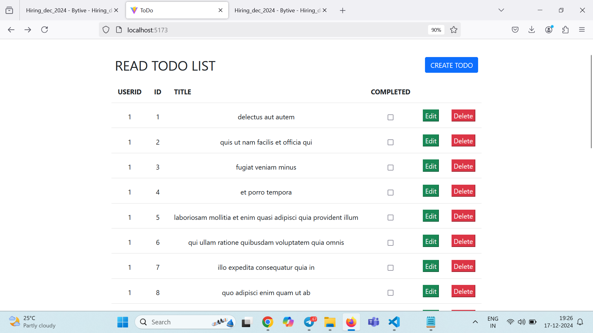
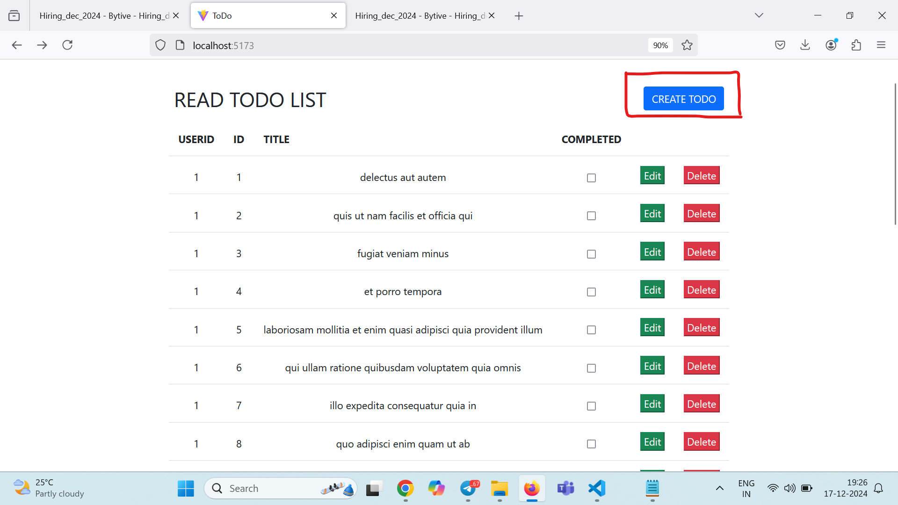
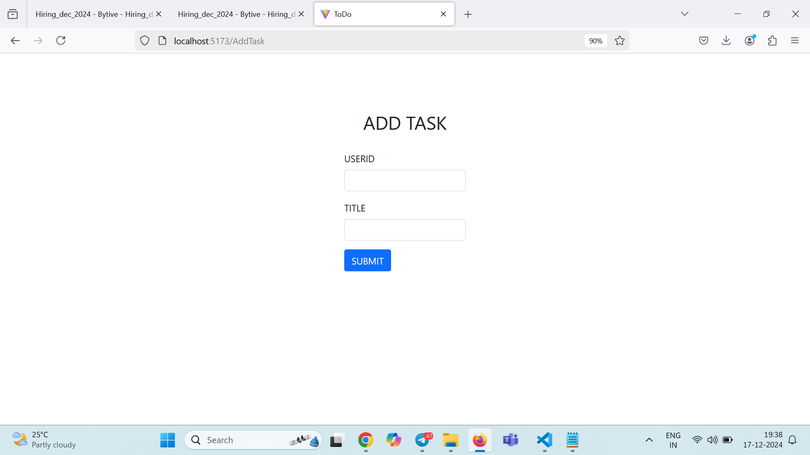
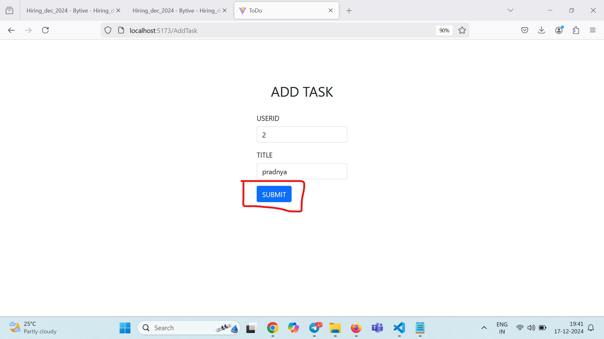
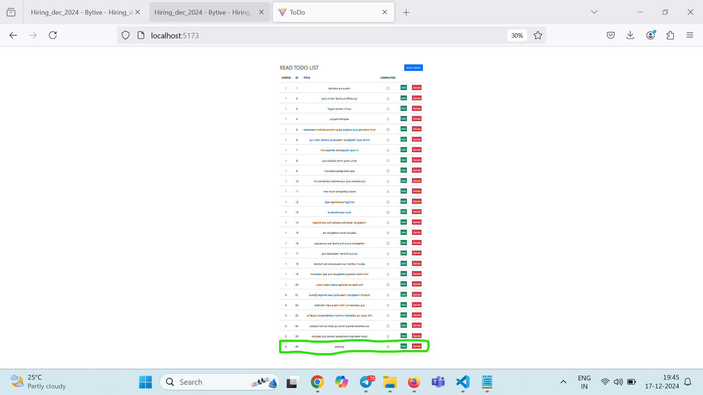
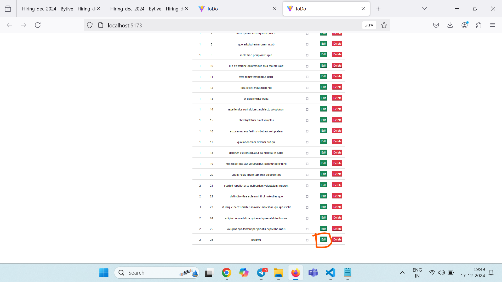
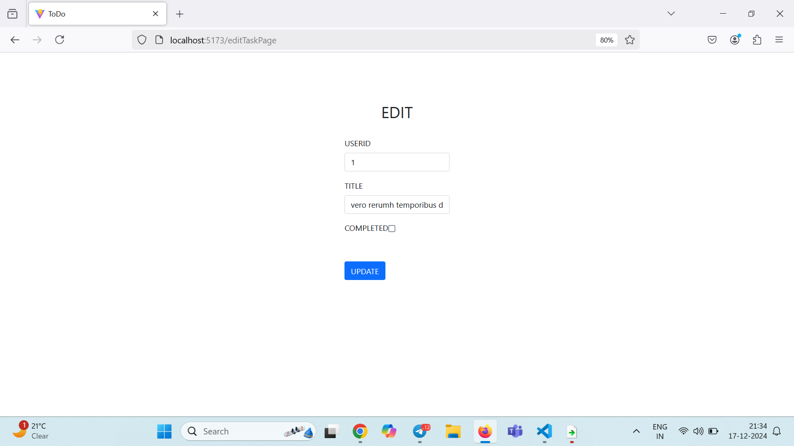
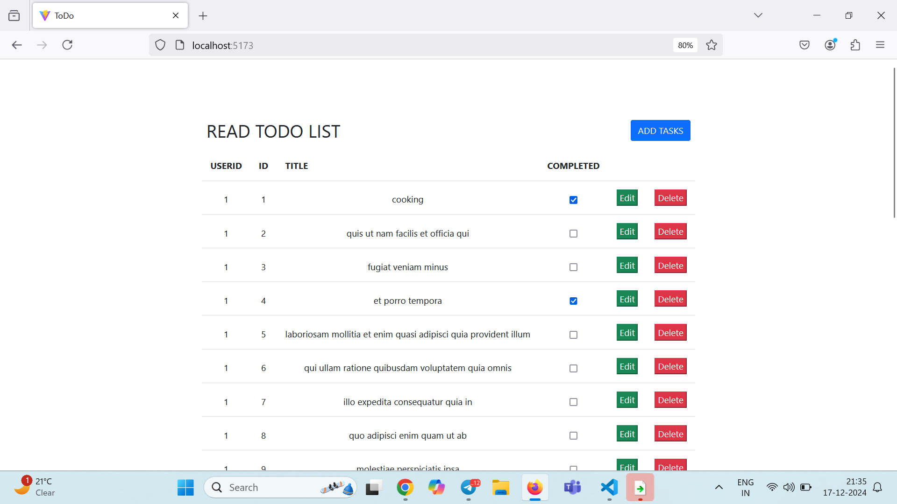
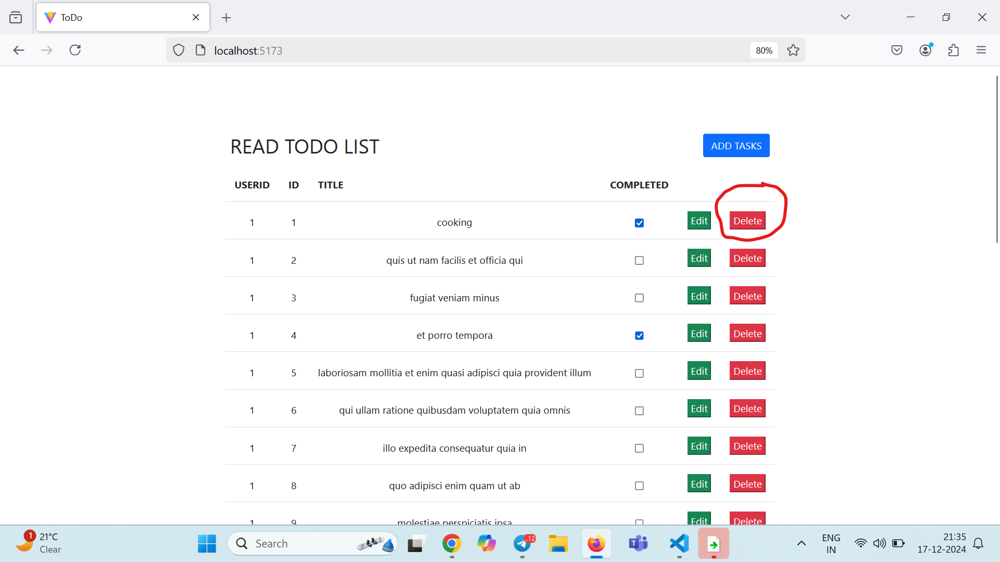
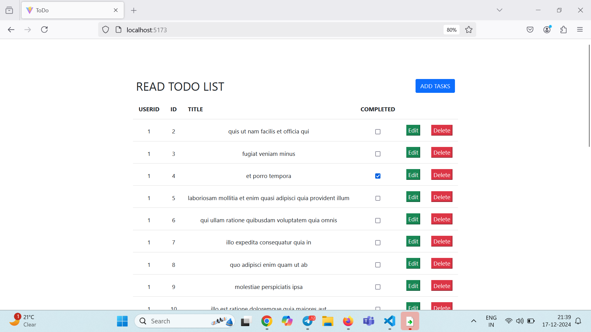

# To-Do List App 📝

## Overview 🌟

The To-Do List app is a simple and efficient AddTask management tool that helps you stay organized and productive. With its user-friendly interface, you can easily add, update, and delete tasks to keep track of your  tasks. This README file provides detailed information on how to use the app effectively and highlights its key features.

## Features 🚀

- ✅ Add tasks with userid and title.
- ✅ Update tasks with userid and title.
- ✔️ Mark tasks as completed or pending with checkboxes.
- 🗑️ Delete tasks with a simple click on the trash icon.
- 📋 Fetch and display data from thr API.
- 🔢 Sort tasks based on userid.

## Screenshots 📸

*Screenshot of the To-Do List app *

*Screenshot of the To-Do List app showing  Addtasks for the "Todo-list app" section.*

*Screenshot of the Add task *

*Screenshot of the Add task page showing a userid , title and submit task .*

*Screenshot of the To-Do List app showing task add in app .*

*Screenshot of the To-Do List app , click edit button to update task.*

*Screenshot of the open edit task page.*

*Screenshot of the  To-Do List app  with update task task.*

*Screenshot of the  To-Do List app  to delete  1 task.*

*Screenshot of the  To-Do List app to  deleted 1 task and update app.*

## How to Use 📖

1. **Adding a Task:** To add a new task, enter the task userid and title in the input fields provided. Press the "Add" button or press Enter to save the task to the Todo app list.

2. **Updataing task:**
To edit a task, click on the update to update.

3. **Checkbox:** Each task has a checkbox beside it. Check the box to mark a task as completed. Uncheck it to mark it as pending.

4. **Delete Task:** To delete a task, click on the trash icon beside the task. A confirmation popup will appear to confirm the deletion.

## Important Notes ⚠️

- Please ensure to fill both the task description and  fields before adding a new task.
- Tasks are sorted based on id.
- This app is completely responsive.
- For the app to work properly, you need to host it on a localhost or a server. Simply opening the index file as a web page won't provide the required functionality.

-npm run dev for run the code
-for API use mockapi platform